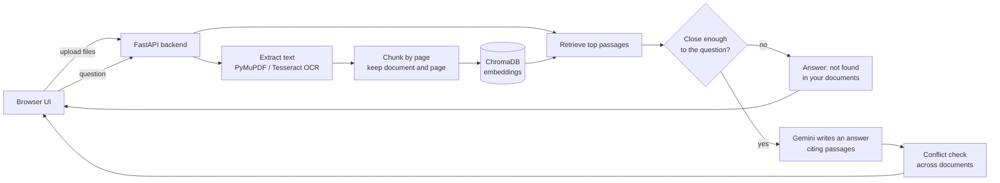

# InquireX

**Ask questions across your documents and get answers you can verify.** InquireX reads PDFs, scans, images and text files, answers in plain language, shows the exact passages behind every answer, flags documents that contradict each other, and says "I couldn't find that" instead of guessing.

[](https://inquirex.onrender.com/)


**Live demo: https://inquirex.onrender.com/**

> The demo runs on a free tier. If it has been idle, the first load (and the first upload) can take up to a minute while the service wakes up. Please upload only made-up sample documents: uploaded files are visible to every visitor.

---

## Features

- **Many formats:** PDF, TXT, Markdown, PNG and JPG. Scanned PDFs and images are read with local OCR (Tesseract).
- **Cited answers:** every answer links to the source document and page, with the supporting phrase highlighted.
- **Conflict detection:** when passages from different documents disagree (a different total, date or term), InquireX shows both sides instead of silently picking one.
- **Honest uncertainty:** a relevance gate refuses questions the documents can't answer, and each answer carries a confidence level with a reason.
- **Graceful fallback:** if the language model is unavailable or rate-limited, the app still searches and returns clearly labeled source excerpts.
- **Broad questions work too:** "Summarize this" or "What is this document about?" use each document's opening passages rather than failing a similarity check.
- **Investigation history:** username-based workspaces keep past investigations (see the privacy note below).

## Try it in two minutes

1. Open the demo and choose a username (3-24 letters, numbers or underscores).
2. Create two short text files that disagree, for example:
   - `invoice_a.txt`: "Invoice 1042. Total due: $4,500. Payment deadline: March 10."
   - `invoice_b.txt`: "Invoice 1042. Total due: $5,200. Payment deadline: March 10."
3. Upload both and ask: **"What is the total due on invoice 1042?"**
4. You should see an answer with citations and a **"These documents disagree"** panel showing both amounts.
5. Ask something unrelated, like "What's the weather in Paris?" The app should say it couldn't find anything.

## How it matches the problem statement (ALG-AI-02)

| Requirement | Where it lives |
|---|---|
| Multiple document formats | `services/extract.py` (PDF, text, image OCR) |
| Extraction and indexing | `services/chunking.py`, `services/vectorstore.py` |
| Natural-language Q&A | `routes/ask.py`, `services/answer.py` |
| Source and section references | page-level citations with highlighted phrases |
| Conflict detection | `services/conflicts.py` |
| Uncertainty handling | relevance gate in `routes/ask.py`, confidence levels, source-only fallback |

## Architecture



**Key decisions**

- **Retrieval first, generation second.** The model only sees passages the search returned, and it is told to answer from those alone.
- **A relevance gate** (`MAX_DISTANCE`) stops the app from improvising when nothing in the documents is close to the question.
- **Citations are validated.** A highlight is only shown if the exact phrase really appears in the cited passage.
- **Failure is visible, not hidden.** The API reports whether an answer was generated, source-only, or refused for lack of evidence, and why.
- **One origin.** FastAPI serves the UI and the API together, which keeps local setup and deployment to a single server.

## How it works

1. The frontend uploads files to `POST /api/documents`.
2. The backend extracts text page by page. Image-only pages and image files go through Tesseract OCR.
3. Text is split into overlapping chunks and stored in a persistent ChromaDB collection (using Chroma's built-in embedding model). A small JSON registry stores document names and page counts.
4. A question is matched against the chunks. If the best match is too distant, the app answers that the evidence isn't there.
5. Otherwise the model receives the numbered passages and returns an answer, a confidence level, and which passages support it. The API validates every reference before returning citations.
6. A second model call compares passages from different documents for material contradictions.

## Quick start

### Windows

```bash
cd backend
py -3.11 -m venv .venv
.\.venv\Scripts\python.exe -m pip install -r requirements.txt
copy .env.example .env
```

Edit `backend/.env` and set `GEMINI_API_KEY` (a free key is available from Google AI Studio). Then, from the project folder:

```bash
run.bat
```

Open http://127.0.0.1:8000. Interactive API docs are at `/docs` and a health check is at `/api/health`.

### macOS and Linux

```bash
cd backend
python3 -m venv .venv
. .venv/bin/activate
python -m pip install -r requirements.txt
test -f .env || cp .env.example .env
python -m uvicorn app.main:app --reload
```

Requirements: Python 3.11 or newer. Tesseract OCR is optional (needed only for scanned PDFs and images). Without an API key the app still supports upload, search and source-only responses.

## Configuration

Settings are read from `backend/.env` or the process environment.

| Variable | Default | Purpose |
|---|---|---|
| `LLM_PROVIDER` | `gemini` | `gemini` or `anthropic` |
| `GEMINI_API_KEY` | unset | Enables written answers and conflict checks with Gemini |
| `ANTHROPIC_API_KEY` | unset | Used when `LLM_PROVIDER=anthropic` (also run `pip install anthropic`) |
| `LLM_MODEL` | provider default | Model name. Set this explicitly to a model your key can use |
| `MAX_DISTANCE` | `0.75` | Relevance gate. Lower is stricter |
| `ALLOWED_ORIGINS` | local origins | CORS origins, only needed if the frontend is hosted separately |
| `TESSERACT_CMD` | on `PATH` | Full path to the Tesseract executable |
| `OCR_LANG` | `eng` | Tesseract language codes, such as `eng+hin` |

Never commit a real key. `backend/.env` is git-ignored; `backend/.env.example` is the template.

## API

| Route | Method | Purpose |
|---|---|---|
| `/api/health` | GET | Service, model and OCR status |
| `/api/documents` | GET | List indexed documents |
| `/api/documents` | POST | Upload files (`multipart/form-data`, field `files`) |
| `/api/documents/{doc_id}` | DELETE | Remove a document |
| `/api/accounts/login` | POST | Open or create a username workspace |
| `/api/accounts/{username}` | PUT | Save an investigation history |
| `/api/search` | POST | Search passages, optionally filtered by document |
| `/api/ask` | POST | Retrieve evidence and answer a question |

## Deployment (Render, free tier)

The live demo is a single Render web service:

| Setting | Value |
|---|---|
| Root Directory | *(blank)* |
| Build Command | `pip install -r backend/requirements.txt` |
| Start Command | `cd backend && uvicorn app.main:app --host 0.0.0.0 --port $PORT` |
| Instance Type | Free |
| Environment | `PYTHON_VERSION=3.11.9`, `LLM_PROVIDER=gemini`, `GEMINI_API_KEY`, `LLM_MODEL`, `MAX_DISTANCE` |

The Root Directory is left blank because the backend serves the `frontend/` folder next to it.

## Testing

```bash
cd backend
python -m pip install pytest
python -m pytest tests/
```

The suite covers chunking, the source-only summary path, the relevance gate, summary-question routing, account storage, input validation and extraction edge cases.

## Project layout

```
backend/
  app/
    routes/       FastAPI handlers (documents, ask, search, accounts)
    services/     extraction, chunking, retrieval, answers, conflicts, accounts, LLM client
    config.py     environment settings and data paths
  tests/          unit tests
  .env.example    safe configuration template
  requirements.txt
frontend/
  index.html      single-page interface
  app.js          UI state and API calls
  styles.css      styling
run.bat           Windows launcher
```

## Known limitations

- **Free hosting:** the demo sleeps after about 15 minutes idle, and uploads and accounts reset whenever it restarts.
- **No OCR on the hosted demo.** Scanned PDFs and images need Tesseract, which is only available when running locally.
- **Model quota:** the Gemini free tier is rate-limited. When it runs out, the app returns labeled source excerpts instead of written answers.
- **Conflict detection is model-based,** so it can miss a contradiction or occasionally flag one that isn't material.
- **Summaries are shallow:** broad questions use only the opening passages of each document.
- **The relevance threshold** was tuned by hand on a small set of documents and may need adjusting for other content.
- **Not secure for sensitive data.** Usernames are identifiers, not credentials, and documents are not private per user. Do not upload confidential files or expose a deployment to an untrusted network without adding real authentication.

## Local data and privacy

Runtime data lives in `backend/app/data/` (uploads, the ChromaDB index, the document registry and account histories). It is git-ignored. Stop the server before moving or replacing it.

## Troubleshooting

- **The app won't start:** install dependencies with the same Python that launches Uvicorn (`py -3.11 -m pip install -r backend/requirements.txt`).
- **Answers are source excerpts only:** check `/api/health` for `llm_configured`, confirm the key and `LLM_MODEL`, and look for a quota message. Search keeps working.
- **A model name is rejected:** set `LLM_MODEL` to a model currently available to your key.
- **Scanned PDFs or images fail:** install Tesseract and make sure it is on `PATH`, or set `TESSERACT_CMD`.
- **The first upload is slow or fails once:** the embedding model downloads on first use. Try again after a moment.
- **Login does nothing:** hard refresh (Ctrl+Shift+R) and use a 3-24 character username with only letters, numbers and underscores.

## Technology and disclosures

**Built with:** Python, FastAPI, ChromaDB (built-in embedding model), PyMuPDF, Tesseract OCR via pytesseract, and vanilla JavaScript.

**External services:** Google Gemini API for answer generation and conflict detection. No external datasets are used; all test documents are self-written.

**AI-assisted development:** AI assistants, including Claude, were used while building this project for code generation, debugging and documentation. The result was tested and integrated by the author.

## Built for

ALGOTHON'26, problem statement **ALG-AI-02: Intelligent Document Investigator**.
